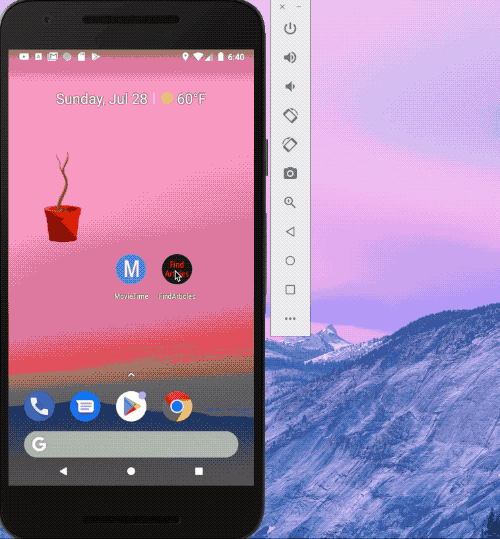

# *FindArticles*

**FindArticles** finds the articles the user interested in the new york times. The app utilizes the [New york times Database API](https://developer.nytimes.com/docs/articlesearch-product/1/routes/articlesearch.json/get) to search and display articles.

Time spent: A week spent in total

## Video Walkthrough

Here's a walkthrough of the app:

## User Stories

I use **Java** to compelete this Application. The following **required** functionality is completed:

* [X] User can **scroll through all the articles** find from the New York Times Database API
* [X] User can **Endlessly get the data in the server** to find their interested articles.
* [X] User can According to the their interesting topic to show the articles and store these information **use preference** .
* [X] Even though there is no network available, the user can also see the same articles list as they loaded last time.
* [X] Use the **DatePicker** to pick the begin date of the articles list.
* [X] User can use **SearchView** to find their interested articles by using keywords.
* [X] For each article displayed, user can see the details of the articles.
  * [X] Use **WebView** to display the selected article.
  * [X] User can **share the article's url**.
* [X] Layout is optimized with the **RecyclerView** pattern.

The following **optional** features are implemented:

* [X] User can **swipe-to-refresh** latest stream to get the latest articles.
* [X] The lateset articles will be stored in the **Realm Database**.
* [X] Display a **loading indicator** during loading.
* [X] Display the empty view for empty results.
* [X] Improved the user interface through styling and coloring.
	* [X] Use different view type for article with image and without image.
	* [X] Add margin or padding for each elements in article item.
	* [X] Custom the background the color of article list.

The following **bonus** features are implemented:

* [X] Use **ViewModel** and **LiveData** to optimize the Architecture.
* [X] Use **BindingAdapter** and **data transform** to bind the data and reduce codes.
* [X] Use **Realm Database** and **LiveData** to generate our database and get the data in the database.
* [X] Use **async-http** to fetch the data online.
* [X] Allow user to view details of the article using WebView to show the web page within a separate fragment.
* [X] Use a **DialogFragment** to show the preference settings.
* [X] Allow users to share the url of the articles.
* [X] Apply the popular [Data-binding library](https://developer.android.com/topic/libraries/data-binding) to reduce boilerplate code.
* [X] Apply the images of the articles using **Glide** transformations.
* [X] Use the CardView to show the articles list.
* [X] Use the **SwipeRefreshLayout** allow user to pull to refresh the articles.

The following **additional** features are implemented:

* [X] Use Fragment
* [X] Use navigation
* [X] Add launch icon

## Open-source libraries used

- Realm Database
- ViewModel
- LiveData
- Glide
- Async Http
- CardView
- Parceler
- Preference
- DatePicker

## License

    Copyright 2019 Yini Duanmu

    Licensed under the Apache License, Version 2.0 (the "License");
    you may not use this file except in compliance with the License.
    You may obtain a copy of the License at

        http://www.apache.org/licenses/LICENSE-2.0

    Unless required by applicable law or agreed to in writing, software
    distributed under the License is distributed on an "AS IS" BASIS,
    WITHOUT WARRANTIES OR CONDITIONS OF ANY KIND, either express or implied.
    See the License for the specific language governing permissions and
    limitations under the License.